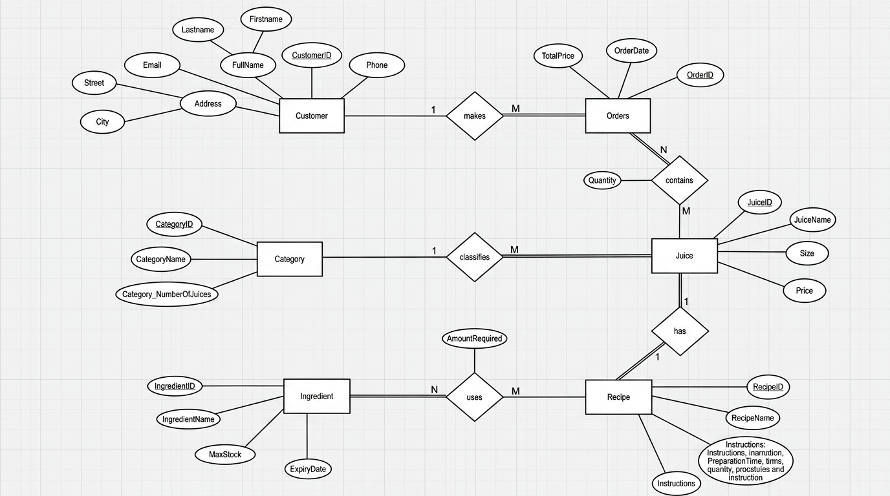

# JuiceMarket Database

A relational database project for managing the operations of a juice market using **SQL Server**.

## Project Overview

The database is designed to handle the main operations of a juice market, including:

* Managing customer information
* Managing juice products and their details
* Recording customer orders
* Managing order details and quantities
* Tracking product sales and related information

The project covers the database development process, from designing the relational schema and ERD to implementing the database using SQL.

## Technologies

* Microsoft SQL Server
* SQL
* SQL Server Management Studio (SSMS)

## Database Design

The database was designed using a relational model with multiple related entities.

### ERD

### Schema

The relational schema and table structures are available in the [`Schema`](Schema) folder.

## SQL Implementation

The project includes SQL scripts for:

* Database and table creation
* Primary and foreign keys
* Constraints
* Data insertion
* Data retrieval and manipulation
* Joins and aggregate queries

## How to Run

1. Open **SQL Server Management Studio (SSMS)**.
2. Open the SQL script from the `SQL` folder.
3. Execute the script to create and populate the database.
4. Run the included queries to explore the database.

## Purpose

This project was created to practice relational database design and SQL Server implementation, including database modeling, relationships, constraints, and SQL queries.
